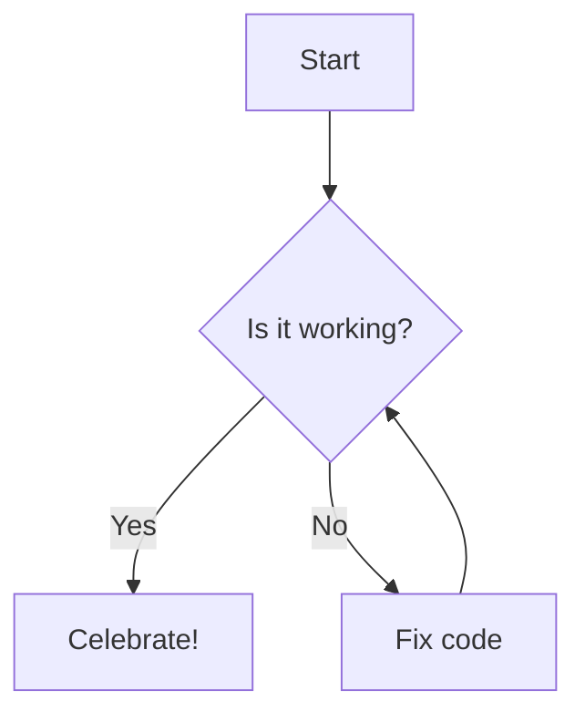

# GitHub Advanced Markdown Cheatsheet

This document demonstrates advanced features supported by GitHub's Markdown renderer.

## 1. Alerts (Callouts)
Use these to highlight specific information with color-coded blocks.

> [!NOTE]
> Highlights information that users should know, even when skimming.

> [!TIP]
> Optional help for better or easier usage.

> [!IMPORTANT]
> Crucial information for success.

> [!WARNING]
> Critical content demanding immediate attention.

> [!CAUTION]
> Negative potential consequences of an action.

---

## 2. Collapsible Sections (Details)
Keep your pages clean by hiding long logs or secondary details.

  
▶️ Click to expand some secret info

  This content is hidden by default! You can put anything here:
  - Lists
  - Images
  - **Bold text**

---

## 3. Mermaid Diagrams (Charts as Code)
Create flowcharts directly in your markdown.

---

## 4. Mathematical Expressions (LaTeX)
Render complex math using MathJax.

The quadratic formula is:
$$\frac{-b \pm \sqrt{b^2 - 4ac}}{2a}$$

And inline math looks like this: $E = mc^2$

---

## 5. Footnotes
Add citations without cluttering your paragraphs.

Here is a statement that needs a reference[^1].

[^1]: This is the footnote content that appears at the very bottom of the page.

---

## 6. Color Swatches
Display a small color preview by wrapping a hex code in backticks.
*Note: Primarily works in GitHub Issues and Pull Request comments.*

The primary theme color is `#FF5733`.

---

## 7. Keyboard Keys (KBD)
Stylize keyboard shortcuts for documentation.

Press <kbd>Ctrl</kbd> + <kbd>Shift</kbd> + <kbd>P</kbd> to open the command palette.

---

## 8. Interactive Task Lists
Visual checklists for project management.

- [x] Finished task
- [ ] Task still in progress
- [ ] Upcoming feature

---

## 9. Table Alignment
Control column alignment using colons in the separator.

| Left Aligned | Center Aligned | Right Aligned |
| :--- | :---: | ---: |
| Text | More Text | $100.00 |

---

## 10. Code Line Highlighting
You can link to specific lines in a file by appending `#L` to the URL.

[Example Highlight Link](https://github.com/user/repo/blob/main/script.py#L10-L15)
